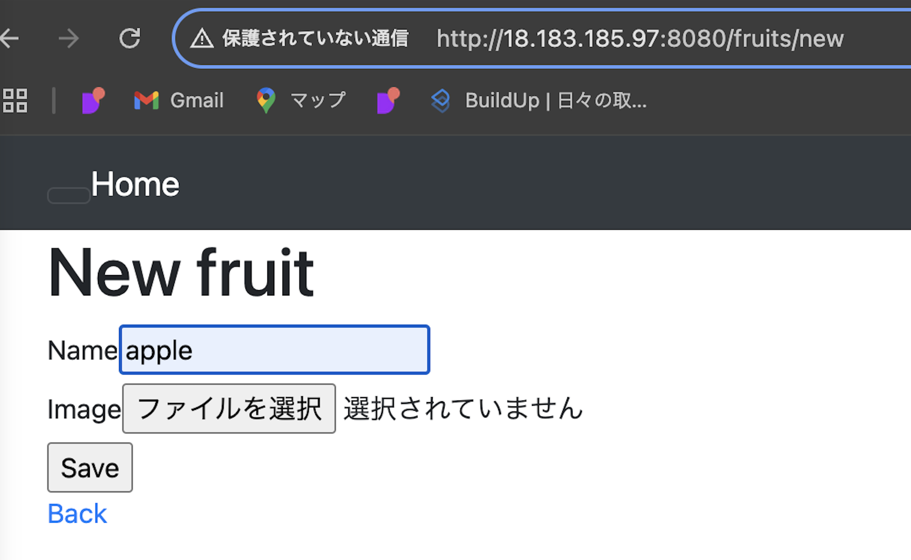
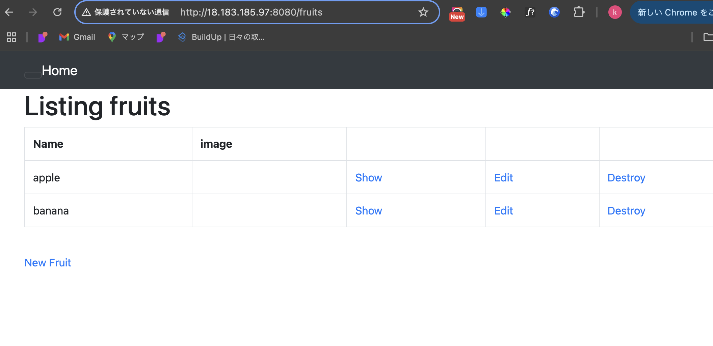
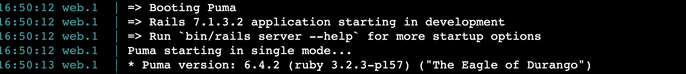
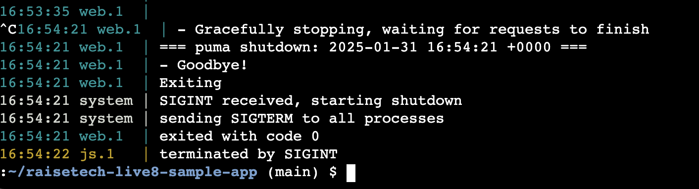
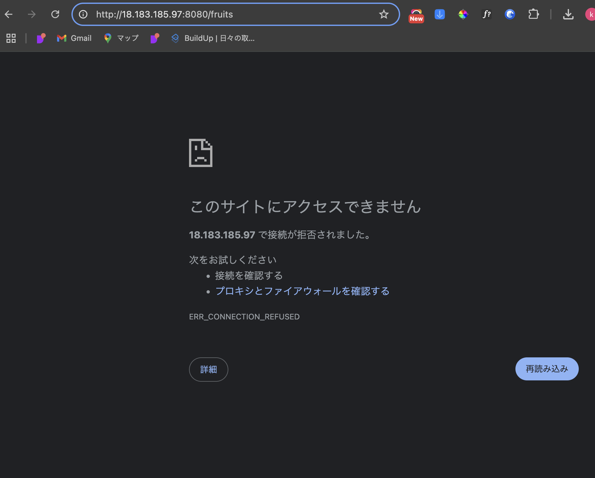
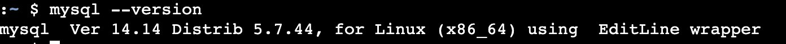
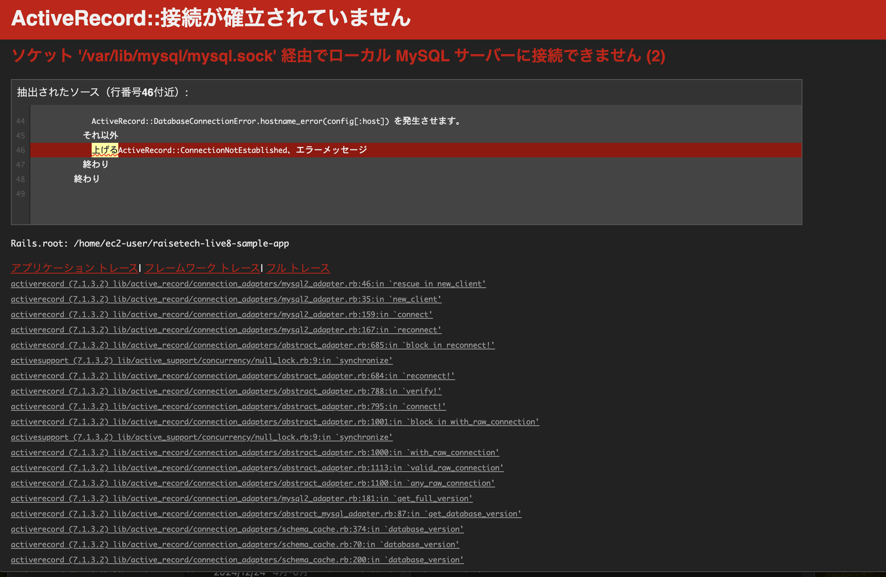
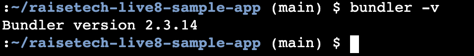

# 第3回課題

## 課題内容：サンプルアプリケーションの起動
 
 
 

### サンプルアプリケーションの起動
* サイトにアクセスしてみるとListing fruitsというWebアプリケーションが起動します
 

 
 
* フルーツ名の入力と保存ができます
 
  
 
 
 

### AP サーバーについて調べる
* AP サーバーの名前とバージョン
 名前：Puma バージョン：6.4.2　
 

 
 
* AP サーバーを終了させた場合、引き続きアクセスできるかを確認
 

 
 
* ADサーバーを終了すると、サイトにアクセスできなくなります

 
 
 

### DB サーバーについて調べる
*  DB サーバー（DB エンジン）の名前とバージョン
 名前：MySQL バージョン：5.7.44
 

 
 
* DBサーバーを終了すると、サイトにエラー内容が表示され、アクセスができません
 

 
 
 
　
### Rails の構成管理について調べる
* Rails の構成管理ツールの名前
 名前：Bundler バージョン：2.2.33
 

 
 

## 課題３より学んだこと
 
* HTMLとCSSを使用してWebサイトの公開まで行ったことと比較すると、Webアプリケーションを起動はサーバーやネットワークの仕組みについてより深い知識が必要だと実感しました。
 
 
*サーバーが起動しないエラーが何度もありましが、ChatGPTを活用して原因と対策について調べました。
ChatGPTの使用は初めてでしたが、利用に慣れる良い機会となりました。
 
 
*初学者のため、AWSエンジニアの仕事全体像がまだ掴めていないので、これからの講義・課題を通じてもっと学びを深めたいです。

