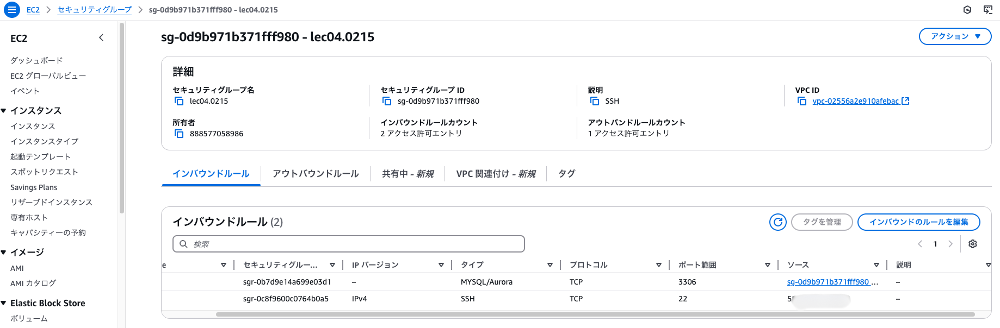
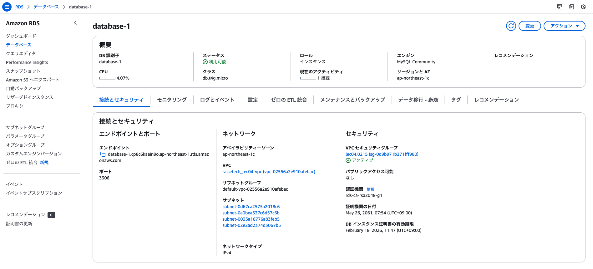
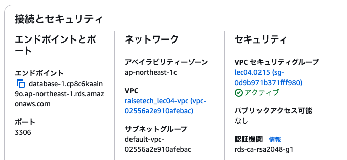
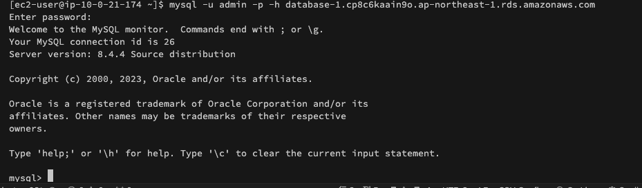

# 第4回課題
## 作成したVPC

## 作成したEC2

## EC2のセキュリティグループ
"sg-0d9b971b371fff980 (lec04.0215)"というセキュリティーグループを作成。

* SSHで接続できるようにポート22を開放しますが、自分のIPアドレスからの接続のみを許可。
* EC2とRDS に接続できるようにポート3306を開放。EC2とRDSは、同一のVPCに存在しているので、EC2のセキュリティーグループIDを設定し、接続許可の範囲を設定。

* アウトバンドは特に設定無し。

## 作成したRDS

## 作成したRDSのセキュリティグループ
セキュリティーグループは、"lec04.0215 (sg-0d9b971b371fff980)"と設定しており、EC2インスタンスと同じセキュリティーグループで設定。

## EC2からRDSへの接続
セキュリティーグループでタイプ：MYSQL/Aurora、ポート：3306、ソース：EC2のセキュリティグループIDを設定したので、無事に接続完了。

## 課題４の感想
EC2にMySQLをインストールするのに手間取りました。
セキュリティーグループの設定でも混乱してしまったため、何度かVPC、EC２、RDS を作成し直しました。
そのおかげなのか、IPアドレスってなに？と調べたり、ターミナルでSSHへ接続する方法などを調べ、興味や関心が広がってきました。
