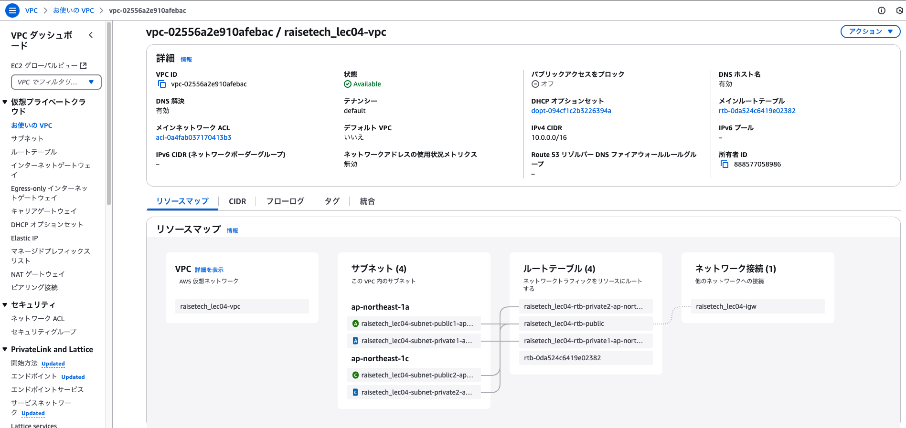
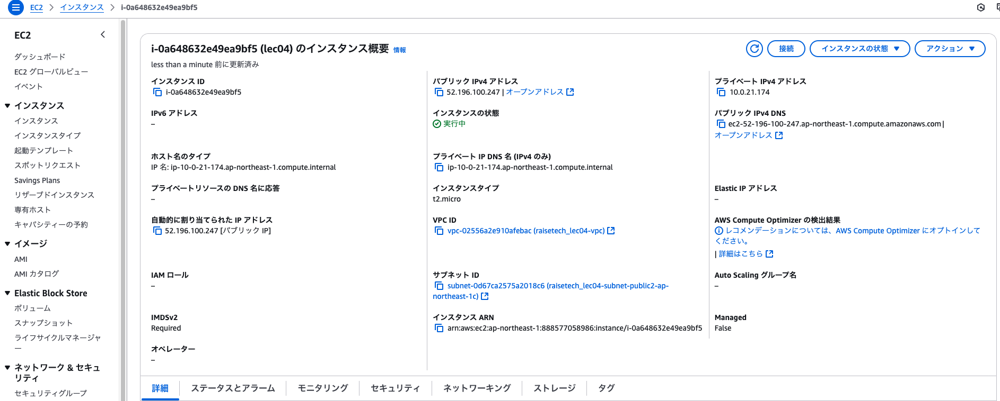
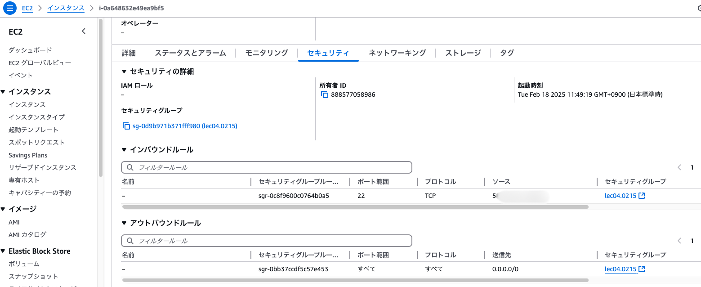
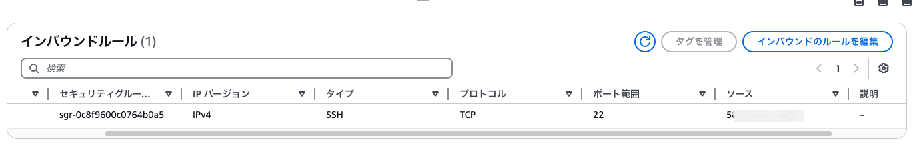
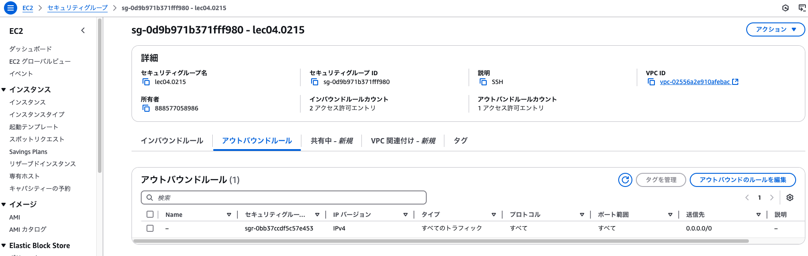
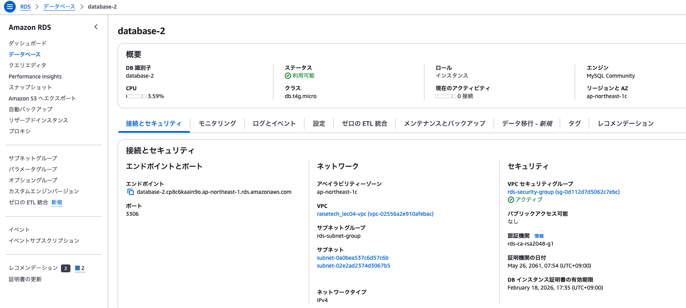
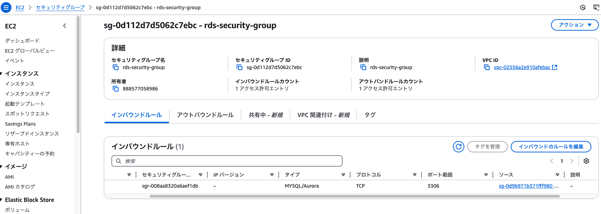
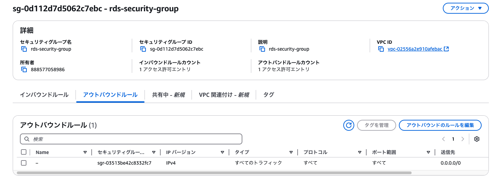

# 第4回課題

## 作成したVPC

## 作成したEC2

## EC2のセキュリティグループ

"sg-0d9b971b371fff980 (lec04.0215)"というセキュリティーグループを作成。

🔸インバウンドルール

SSHで接続できるようにポート22を開放。自分のIPアドレスからの接続のみを許可。

🔹アウトバンドルール

特に設定無し。

## 作成したRDS

## 作成したRDSのセキュリティグループ

セキュリティーグループは、rds-security-group (sg-0d112d7d5062c7ebc)を作成。

🔸インバウンドルール

MYSQL/Aurora、ポート：3306、ソース：EC2のセキュリティグループIDを設定。

🔹アウトバンドルール

特に設定無し。

## EC2からRDSへの接続

mysql -u admin -p -h ［RDSのエンドポイント］

RDS のパスワードを入力し、EC2からRDSに接続完了！

## 課題４の感想

EC2にMySQLをインストールするのに手間取りました。
セキュリティーグループの設定でも混乱してしまったため、何度かVPC、EC２、RDS を作成し直しました。
そのおかげなのか、IPアドレスってなに？と調べたり、ターミナルでSSHへ接続する方法などを調べ、興味や関心が広がってきました。
